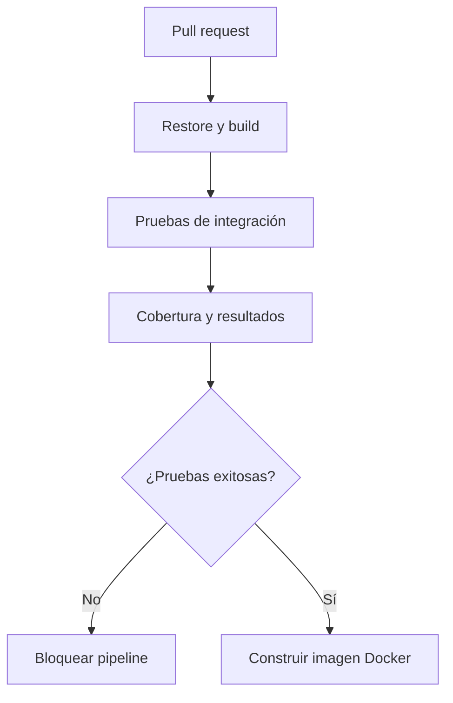

# Laboratorio AZ-400 01: pruebas y cobertura en el pipeline

## Brecha que trabaja

**Diseñar e implementar una estrategia de pruebas para las canalizaciones.**

Esta fue una de las tres áreas prioritarias indicadas en el score report. El laboratorio convierte la API `RickAndMorty` del curso en una aplicación validada automáticamente antes de construir su imagen Docker.

## Objetivos

Al terminar podrás:

- Diferenciar build validation, pruebas de integración y validación del contenedor.
- Ejecutar pruebas de una Minimal API con `WebApplicationFactory`.
- Publicar resultados TRX y cobertura como artifacts.
- Ordenar jobs mediante dependencias.
- Explicar por qué una imagen no debe publicarse si las pruebas fallan.
- Reconocer la diferencia entre ejecutar pruebas y establecer un quality gate.

## Flujo



La dependencia `needs: test` impide ejecutar el job de contenedor cuando falla el job de pruebas.

## Archivos del laboratorio

- `AzureContainerRegistry/RickAndMorty.Tests/`: proyecto xUnit.
- `.github/workflows/az400-pipeline-testing.yml`: pipeline.
- `AzureContainerRegistry/RickAndMorty/Program.cs`: expone `Program` y admite el entorno `Testing`.
- `AzureContainerRegistry/RickAndMorty/dockerfile`: usa la imagen correcta de ASP.NET Core.

## Parte 1: ejecución local

Desde la raíz del repositorio:

```bash
dotnet restore AzureContainerRegistry/RickAndMorty.Tests/RickAndMorty.Tests.csproj

dotnet build   AzureContainerRegistry/RickAndMorty.Tests/RickAndMorty.Tests.csproj   --configuration Release   --no-restore

dotnet test   AzureContainerRegistry/RickAndMorty.Tests/RickAndMorty.Tests.csproj   --configuration Release   --no-build   --logger "trx;LogFileName=tests.trx"   --collect "XPlat Code Coverage"   --results-directory TestResults
```

Valida que las tres pruebas terminen correctamente y que `TestResults` contenga un archivo `.trx` y un reporte Cobertura.

## Parte 2: validación del contenedor

```bash
docker build   --file AzureContainerRegistry/RickAndMorty/dockerfile   --tag rickandmorty:test   AzureContainerRegistry/RickAndMorty
```

El Dockerfile original utilizaba `mcr.microsoft.com/dotnet/runtime`. Una aplicación ASP.NET Core requiere `mcr.microsoft.com/dotnet/aspnet`, que contiene el shared framework web.

## Parte 3: pipeline

Abre `.github/workflows/az400-pipeline-testing.yml` e identifica:

1. El trigger limitado a los archivos del laboratorio.
2. El principio de permisos mínimos: `contents: read`.
3. El job `test`.
4. La publicación de resultados con `if: always()`.
5. El job `container` condicionado por `needs: test`.

Desde la pestaña **Actions**, ejecuta el workflow manualmente mediante `workflow_dispatch`, o crea un pull request que modifique alguno de los paths configurados.

## Reto guiado: agregar un quality gate real

El workflow actual falla cuando falla una prueba, pero no exige un porcentaje mínimo de cobertura.

Tu reto es establecer un umbral inicial de **70 %**. Investiga una de estas opciones:

- Coverlet MSBuild y sus propiedades `Threshold`, `ThresholdType` y `ThresholdStat`.
- Una herramienta de reporte que pueda fallar el job por debajo del umbral.
- Una política externa de calidad integrada al pipeline.

Documenta por qué elegiste la solución y qué riesgo tiene fijar un porcentaje sin considerar la calidad de las pruebas.

## Criterios de aceptación

- Las tres pruebas se ejecutan correctamente.
- Una prueba fallida bloquea el job de construcción del contenedor.
- Los resultados TRX y la cobertura quedan disponibles como artifact.
- La imagen Docker se construye usando el runtime de ASP.NET Core.
- El workflow puede ejecutarse desde un PR o manualmente.
- Puedes explicar la diferencia entre una prueba unitaria y una prueba de integración.

## Errores frecuentes

### La API responde con redirección

`UseHttpsRedirection` puede redirigir el cliente de pruebas. El laboratorio utiliza el entorno `Testing` para deshabilitar esa redirección únicamente durante las pruebas.

### No se encuentra Program

Las Minimal APIs generan internamente el tipo `Program`. La declaración `public partial class Program` lo hace accesible a `WebApplicationFactory`.

### El contenedor no inicia

Verifica que la etapa final use `mcr.microsoft.com/dotnet/aspnet:10.0-alpine`, no la imagen `runtime`.

### No aparece la cobertura

Comprueba que esté instalado `coverlet.collector` y que `dotnet test` incluya `--collect "XPlat Code Coverage"`.

## Limpieza

Los tests no crean recursos de Azure. Puedes eliminar artifacts locales con:

```bash
rm -rf TestResults
dotnet clean AzureContainerRegistry/RickAndMorty.Tests/RickAndMorty.Tests.csproj
docker image rm rickandmorty:test
```

## Preguntas de validación

1. ¿Por qué el job de Docker depende del job de pruebas?
2. ¿Qué diferencia existe entre publicar cobertura y aplicar un quality gate?
3. ¿Por qué se usa `if: always()` al publicar resultados?
4. ¿Cuándo elegirías un agente self-hosted para estas pruebas?
5. ¿Qué otra prueba agregarías antes de desplegar a Azure Container Apps?

## Respuestas razonadas

1. Para impedir que una imagen potencialmente defectuosa avance cuando la validación de la aplicación falla.
2. La publicación solo conserva la medición; el gate utiliza esa medición para aprobar o rechazar el pipeline.
3. Para conservar evidencia diagnóstica incluso cuando las pruebas fallan.
4. Cuando se necesite software especializado, acceso a redes privadas, hardware particular o control estricto del entorno.
5. Por ejemplo, escaneo de vulnerabilidades, smoke test del contenedor, prueba de contrato o prueba de carga, según el riesgo del sistema.

## Siguiente laboratorio recomendado

Convertir el script `deploy-az-containers.sh` en infraestructura declarativa con Bicep o Terraform, autenticación mediante identidad administrada y validación `what-if` o `plan` dentro del pipeline.
