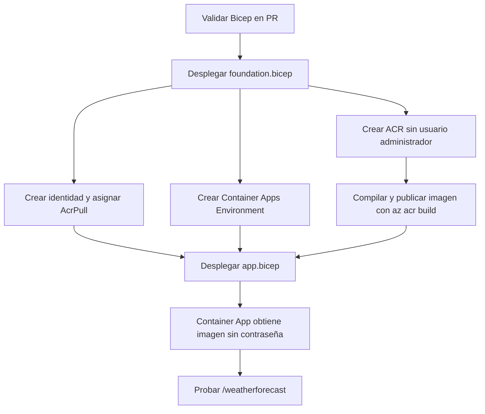

# Laboratorio 02: Azure Container Apps con Bicep e identidad administrada

## Objetivo

Convertir el despliegue imperativo del proyecto RickAndMorty en infraestructura declarativa. El laboratorio crea ACR, Container Apps Environment, una identidad administrada y la asignación `AcrPull`; el administrador de ACR queda deshabilitado y no se almacenan contraseñas.

**Brecha AZ-400:** diseñar e implementar infraestructura como código y canalizaciones seguras.

## Escenario

El script original crea recursos y después lee el usuario y la contraseña administrativos de ACR. Funciona, pero dificulta revisar cambios, repetir entornos y aplicar mínimo privilegio. Se reemplaza por dos despliegues Bicep:

1. `foundation.bicep`: ACR, identidad, `AcrPull` y Container Apps Environment.
2. Publicación de la imagen con `az acr build`.
3. `app.bicep`: Container App que descarga la imagen mediante la identidad.

## Flujo



## Requisitos

- Azure CLI autenticado con `az login`.
- Permiso para crear recursos y asignaciones RBAC en el grupo de recursos.
- Extensión/soporte Bicep disponible en Azure CLI.
- La corrección del Dockerfile de ASP.NET Core incluida en el laboratorio 01 debe estar aplicada antes de desplegar la imagen.

## Paso 1: validar sin crear recursos

```bash
az bicep build --file AzureContainerRegistry/RickAndMorty/infra/foundation.bicep
az bicep build --file AzureContainerRegistry/RickAndMorty/infra/app.bicep
bash -n AzureContainerRegistry/RickAndMorty/infra/deploy-iac.sh
```

El workflow `Validate Bicep IaC` ejecuta estas comprobaciones en cada pull request que modifique el laboratorio.

## Paso 2: revisar qué se va a crear

```bash
az group create --name rickandmorty-iac-rg --location eastus2

az deployment group what-if \
  --resource-group rickandmorty-iac-rg \
  --template-file AzureContainerRegistry/RickAndMorty/infra/foundation.bicep \
  --parameters prefix=rickmorty
```

`what-if` muestra altas, cambios y eliminaciones antes de aplicar la infraestructura.

## Paso 3: desplegar

```bash
chmod +x AzureContainerRegistry/RickAndMorty/infra/deploy-iac.sh
AzureContainerRegistry/RickAndMorty/infra/deploy-iac.sh
```

Variables opcionales:

```bash
RESOURCE_GROUP=mi-rg LOCATION=eastus2 PREFIX=az400lab \
  AzureContainerRegistry/RickAndMorty/infra/deploy-iac.sh
```

## Paso 4: comprobar seguridad y funcionamiento

```bash
ACR_NAME=$(az deployment group show \
  --name foundation \
  --resource-group rickandmorty-iac-rg \
  --query properties.outputs.acrName.value -o tsv)

az acr show --name "$ACR_NAME" --query adminUserEnabled -o tsv

IDENTITY_ID=$(az deployment group show \
  --name foundation \
  --resource-group rickandmorty-iac-rg \
  --query properties.outputs.identityResourceId.value -o tsv)

az role assignment list --scope "$(az acr show --name "$ACR_NAME" --query id -o tsv)" \
  --query "[?principalId=='$(az identity show --ids "$IDENTITY_ID" --query principalId -o tsv)'].roleDefinitionName" \
  -o table

APP_URL=$(az deployment group show \
  --name container-app \
  --resource-group rickandmorty-iac-rg \
  --query properties.outputs.url.value -o tsv)

curl "$APP_URL/weatherforecast"
```

Resultados esperados:

- `adminUserEnabled` devuelve `false`.
- La identidad muestra el rol `AcrPull` en el ACR.
- El endpoint devuelve JSON.
- No existen usuario ni contraseña de ACR en Bicep, logs o configuración del Container App.

## Criterios de aceptación

- [ ] Ambos archivos Bicep compilan.
- [ ] `what-if` se revisó antes del despliegue.
- [ ] ACR se creó con administrador deshabilitado.
- [ ] La asignación RBAC está limitada al ACR.
- [ ] El Container App referencia la identidad administrada para su registro privado.
- [ ] El endpoint responde por HTTPS.
- [ ] El workflow del PR finaliza correctamente.

## Limpieza

```bash
az group delete --name rickandmorty-iac-rg --yes --no-wait
```

No reutilices un grupo de recursos que contenga recursos importantes: este comando elimina todo el grupo.

## Errores frecuentes

- **`AuthorizationFailed` al crear el role assignment:** la cuenta puede crear recursos, pero no asignar roles. Solicita `Owner` o `User Access Administrator` en el alcance apropiado.
- **`UNAUTHORIZED` al descargar la imagen:** comprueba que la identidad del registro en `app.bicep` coincide con la identidad que recibió `AcrPull`. RBAC también puede tardar unos minutos en propagarse.
- **La revisión no inicia:** confirma que la imagen fue publicada antes de desplegar `app.bicep`.
- **El endpoint devuelve error:** usa el puerto interno `8080` para las imágenes modernas de ASP.NET Core y confirma que el Dockerfile usa `mcr.microsoft.com/dotnet/aspnet` en la etapa final.
- **Nombre de ACR inválido o ocupado:** ACR exige un nombre globalmente único, alfanumérico y en minúsculas; la plantilla añade un sufijo determinista con `uniqueString`.

## Preguntas de repaso

1. ¿Qué ventaja ofrece `what-if` en una canalización?
2. ¿Por qué se separa la infraestructura base del despliegue del Container App?
3. ¿Qué diferencia hay entre habilitar el administrador de ACR y usar una identidad administrada?
4. ¿Por qué `AcrPull` se asigna con alcance del ACR y no de la suscripción?
5. ¿Qué evidencia conservarías para una auditoría del pipeline?

## Solución

1. Permite revisar el cambio previsto y establecer una aprobación antes de modificar Azure.
2. La imagen debe existir en ACR antes de que Container Apps pueda crear la revisión; separar las fases hace explícita esa dependencia.
3. El administrador usa credenciales compartidas y de larga duración; la identidad usa Microsoft Entra ID y RBAC sin secretos administrados por el equipo.
4. Es mínimo privilegio: la identidad solo puede descargar imágenes desde ese registro.
5. Resultado de compilación Bicep, salida de `what-if`, aprobación, commit/PR, artefactos ARM compilados y resultado de despliegue.

## Referencias

- Microsoft Learn: Managed identities in Azure Container Apps.
- Microsoft Learn: Azure Container Apps image pull with managed identity.
- Microsoft Learn: Use Bicep to create Azure role assignments.
